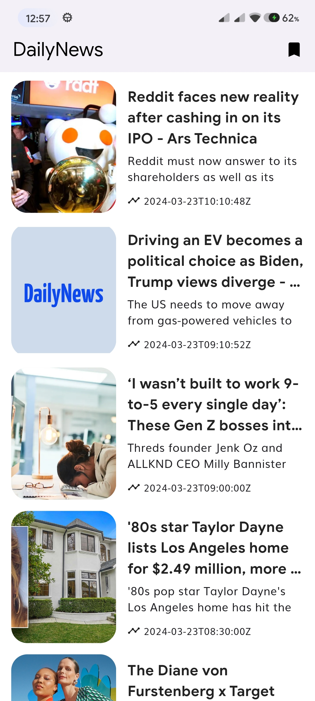

## Flutter NewsApi app 
NewsApp is a sleek and intuitive mobile application designed to keep you informed with the latest news updates from around the globe. With a clean interface and powerful features, staying up-to-date with current events has never been easier. Leveraging the robust capabilities of NewsAPI.org along with cutting-edge technologies like Retrofit, BLoC, GetIt, and Floor, NewsApp delivers a seamless user experience with comprehensive news coverage.


## Key Features
- Daily News Updates: Get access to a wide range of news articles covering diverse topics including politics, technology, business, entertainment, sports, and more.
- Offline Access: Enjoy uninterrupted access to news content even when you're offline, thanks to the offline caching feature powered by Floor.
- Smooth Navigation: Navigate through news categories effortlessly with a user-friendly interface designed for intuitive interaction.
- Seamless Integration: Benefit from seamless integration of Retrofit for efficient API communication and BLoC for state management, ensuring smooth performance and responsiveness.
- Dependency Injection: Utilize GetIt for efficient dependency injection, enhancing the scalability and maintainability of the app's architecture.
  
With DailyNewsApp, you can explore the Flutter Clean Architecture and experience the SOLID coding!

## Getting Started
**Clone the Repository:**
   ```bash
   git clone https://github.com/arrahmanbd/daily_news_clean_architecture.git
```

## Packages

Packages I used in this project 

```bash
  #state management
  flutter_bloc: ^8.1.2

  #comparing dart objects
  equatable: ^2.0.5

  #service locator
  get_it: ^7.6.0
  
  #dateFormat
  intl: ^0.18.1

  #Database
  floor: any

  #make request to api
  retrofit: ^3.0.1

  #Hooks
  flutter_hooks: ^0.18.3

  #chached image 
  cached_network_image: ^3.2.0

  #iconpack
  ionicons: ^0.2.2
```
Using on dev dependency:

```bash
  retrofit_generator: 3.0.1+1
  floor_generator: 1.2.0
  build_runner: 2.1.2
```


## How to Generate Code
To regenarate the models simply run those commands below.

```bash
  flutter pub run build_runner build -d  
```


## Run Project

To test this project Run this command:

```bash
  flutter run 
```
## Screenshots




## 🚀  Follow
[](https://arrahmanbd.github.io/)
[](https://www.linkedin.com/in/arrahmanbd)
[](https://www.github.com/arrahmanbd)


## Badges


[](https://choosealicense.com/licenses/mit/)
[](https://opensource.org/licenses/)
[](http://www.gnu.org/licenses/agpl-3.0)

